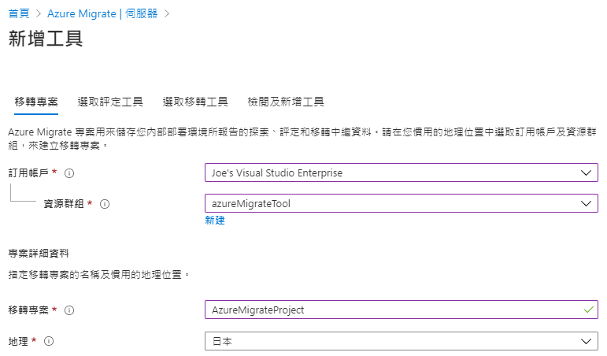
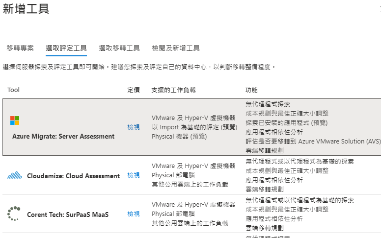
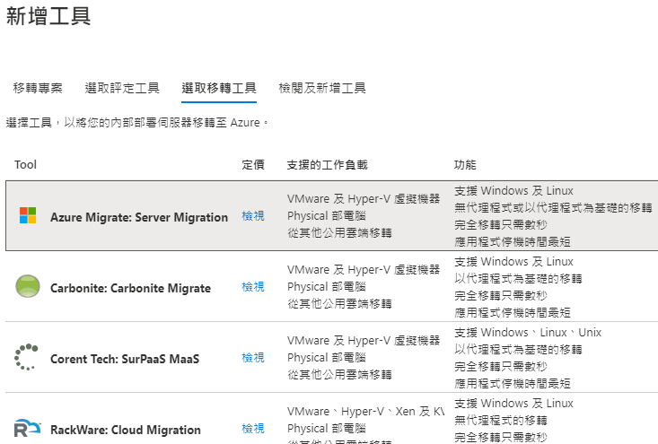
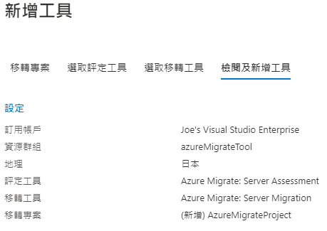

# Lab1 - 建立 Azure Migrate
 
- 進入 Azure Migrate 選擇移轉目標為伺服器，點選新增工具 
 
- 新增移轉專案 AzureMigrateProject 地理選擇日本 
 	
- 選擇 Azure Migrate: Server Assessment 
 	
- 選擇 Azure Migrate: Server Migration 
 	
- 檢閱無誤後，點選新增工具建立 
 

 前往 [Lab2 - 發現 Hyper-V VM](Lab2.md) 