# Lab2 - 發現 Hyper-V VM

- 點選「發現」 
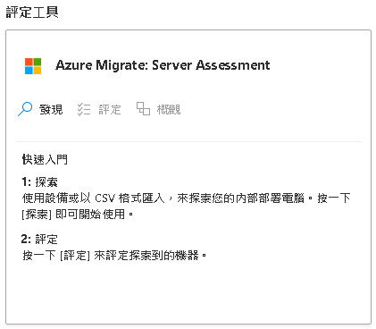
- 選擇「是，使用 Hyper-V」，輸入 Hyper-V 裝置名稱，並點選「產生金鑰」，完成後請複製並記好，最後，點選「下載」.VHD檔案 
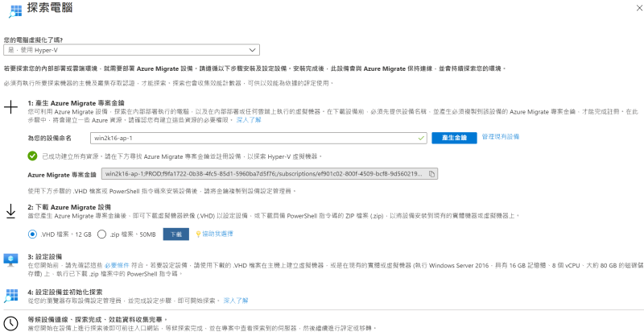 
- 解壓縮 AzureMigrateAppliance.zip，在 Hyper-V Manager 選擇 Import Virtual Machine 匯入 
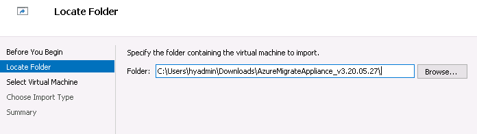 
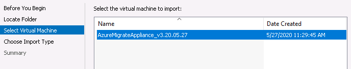 
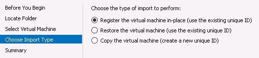 
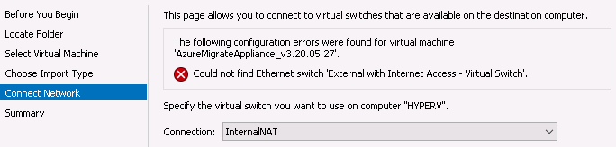 
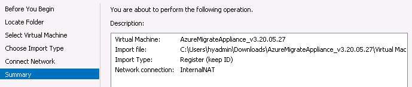 
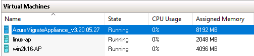 
- 初始化設定 AzureMigrateAppliance_v3.20.05.27 (administrator/isadmin@123) 
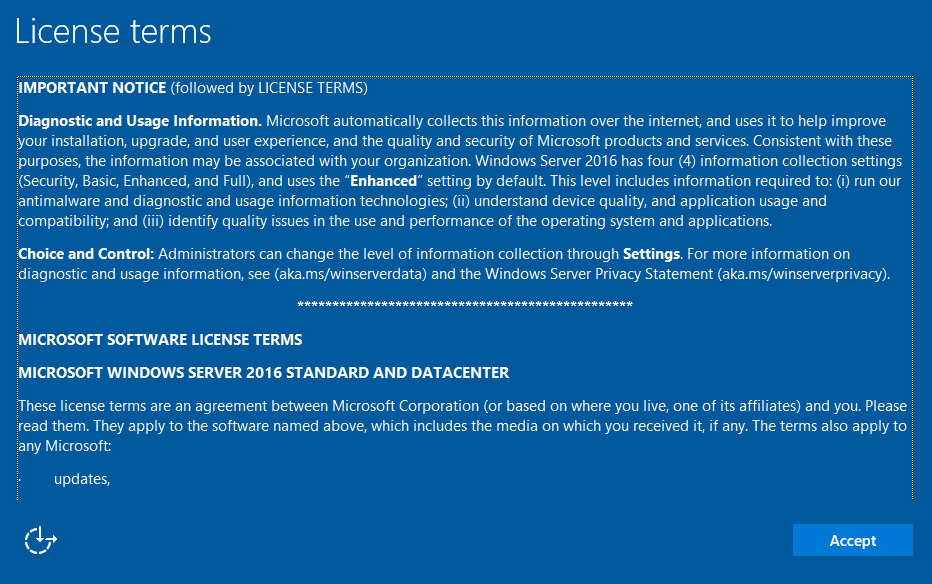 
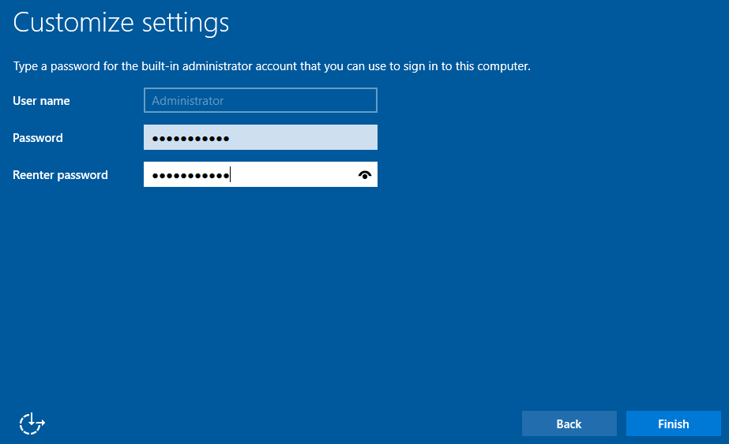 
- 手動設定網路介面 (192.168.0.100/255.255.255.0/192.168.0.1/8.8.8.8) 
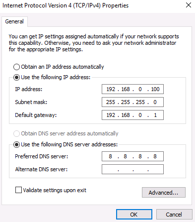 
- 手動設定 C:\Windows\System32\drivers\etc\host，輸入 192.168.0.1 hyperv，儲存此文件
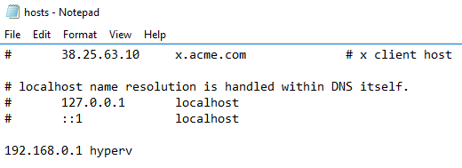 
- Browser https://localhost:44368 
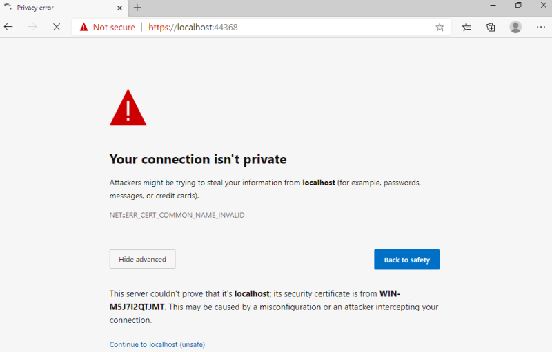 
- Set up prerequisites 
 
- Register with Azure Migrate (將剛儲存的金鑰填入，並登入您的帳號) 
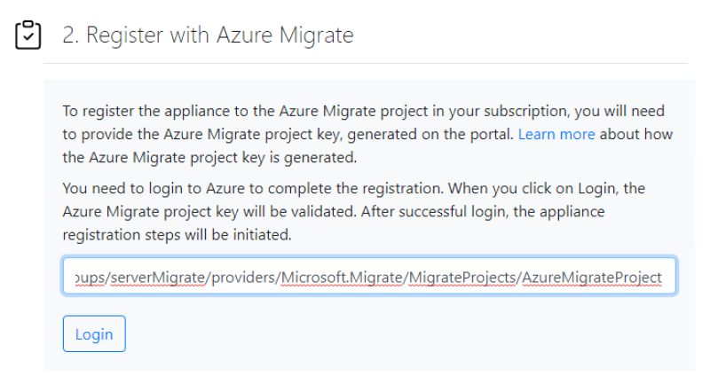 
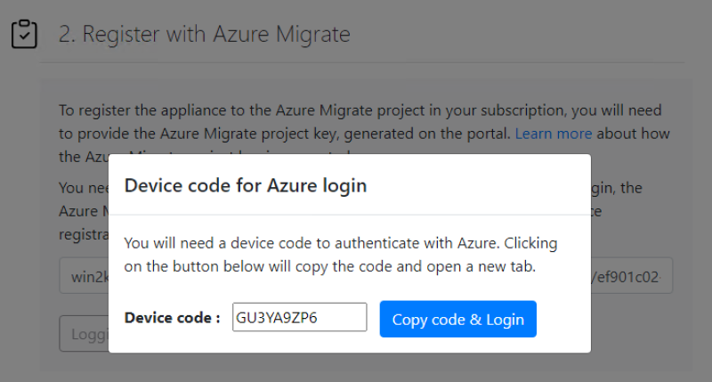 
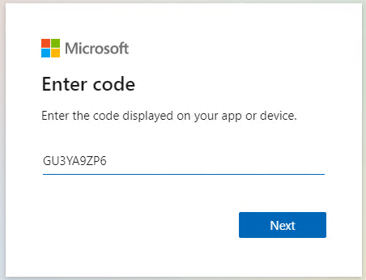 
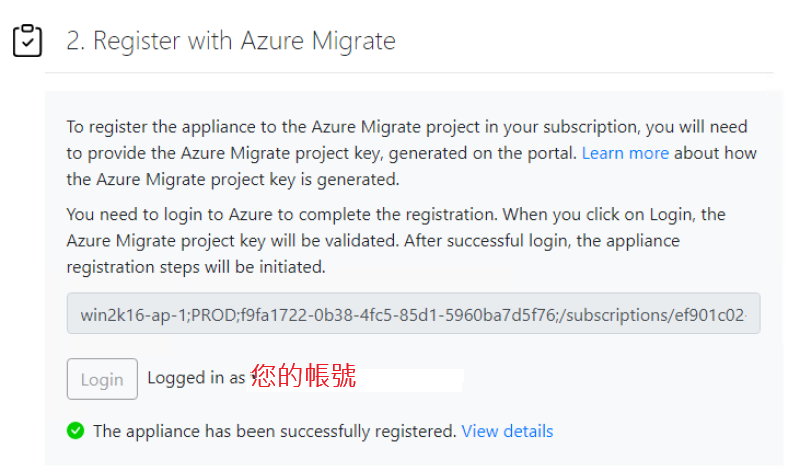 
- Provide Hyper-V hosts details (輸入 hyperv 的驗證帳密 hyadmin/hyadmin@1234) 
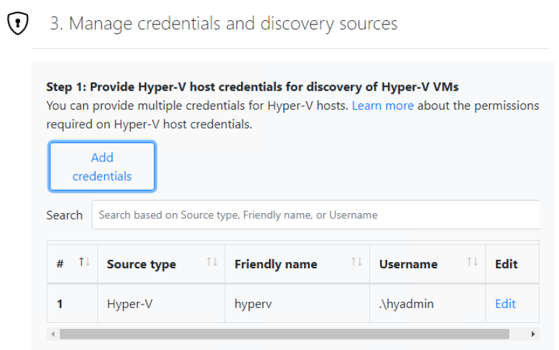 
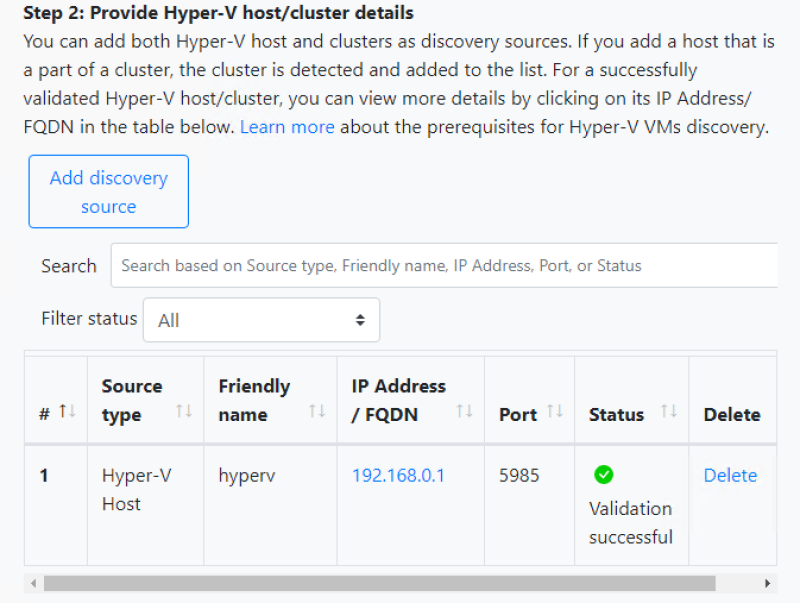 

前往 [Lab3 - 評定 Hyper-V VM](Lab3.md) 