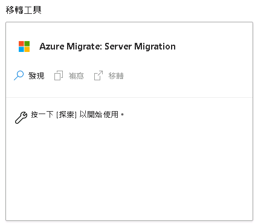
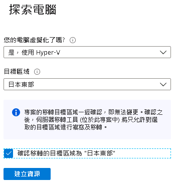
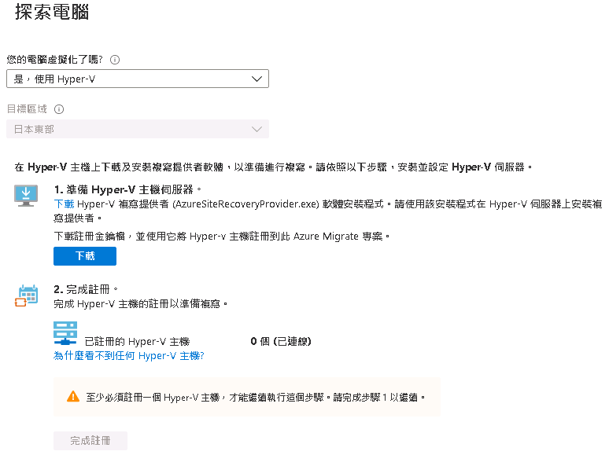
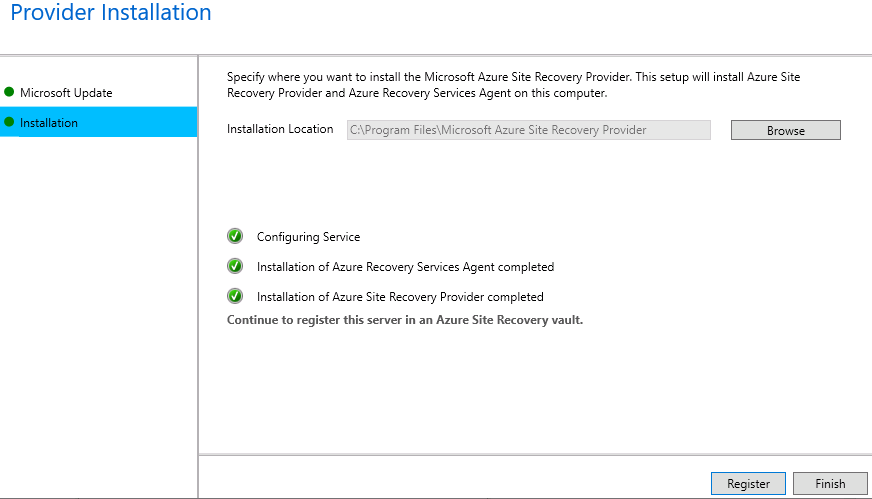
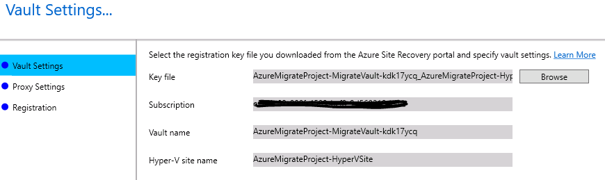
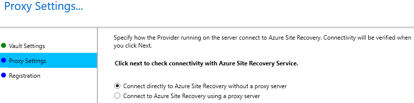
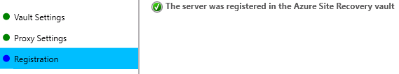
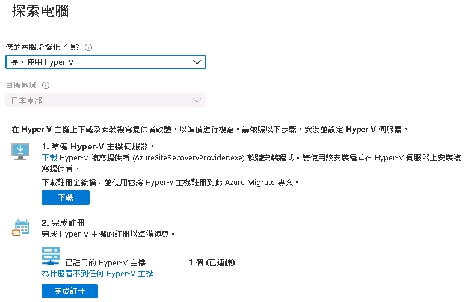

# Lab4 - 移轉 Hyper-V VM

- 在移轉工具 Azure Migrate: Server Migrate窗格中選擇「發現」 
 
- 您的電腦虛擬化了嗎?選擇「是，使用 Hyper-V」，目標區域選擇「日本東部」，勾選確認移轉目標區域為"日本東部" 
 
- 下載 Register Key 並安裝設定 AzureSiteRecoveryProvider 
 
 
 
 
 
- 點選「完成註冊」按鈕，完成註冊 
 

前往 [Lab5 - 複寫 Hyper-V VM](Lab5.md) 