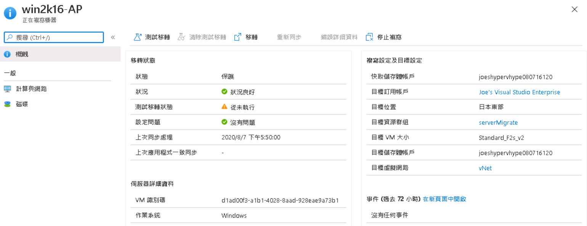

# Lab6 - 執行測試移轉

- 在移轉工具 Azure Migrate: Server Migrate 窗格中選擇「正在複寫的伺服器」 
 
- 查看win2k16-ap複寫狀態並點選 
 
- 查看win2k16-ap複寫詳細資訊 
 
- 點選一般類別中的「計算與網路」 
 
- 因為模擬環境中win2k16-ap的內部靜態 IP 為 192.168.0.5，不變更OS內的網路設定下，必須要設定移轉後的靜態 IP 
 
- 點選「編輯」後，再點選「InternalNAT」，將私人 IP 位置輸入 192.168.0.5 後，點選「確定」，完成後點選「儲存」 
 
- 您現在可以開始進行測試移轉，測試移轉可以讓您不停機的狀況下，測試移轉後的結果是否符合預期。現在就按下「測試移轉」吧! 
    - 虛擬網路請選擇「vNet」後，按下「測試移轉」 
     
    - 查看測試移轉作業，圖示中狀態顯示順利測試移轉 
     
- 尋找並點選資源群組「serverMigrate」，您會發現您的虛擬機器名稱為「win2k16-AP-test」，代表為測試移轉的虛擬機器，您必須手動將基礎設施關聯，等等我們將把公用 IP 「win2k16-ap-pip」關聯至網路介面，請注意，您的公用 IP 與我不同 
 
 
- 現在讓我們在瀏覽器上，輸入公用 IP，檢查是否有正常顯示，如下圖所示，確認服務正常運作! 
 
- 完成測試移轉後，請在「正在複寫的機器」頁面中，點選「...」，選擇「清除測試移轉」，勾選「測試已完成。請刪除測試虛擬機器。」，最後點選「清除測試」 
 
 
前往 [Lab7 - 移轉 VM](Lab7.md) 