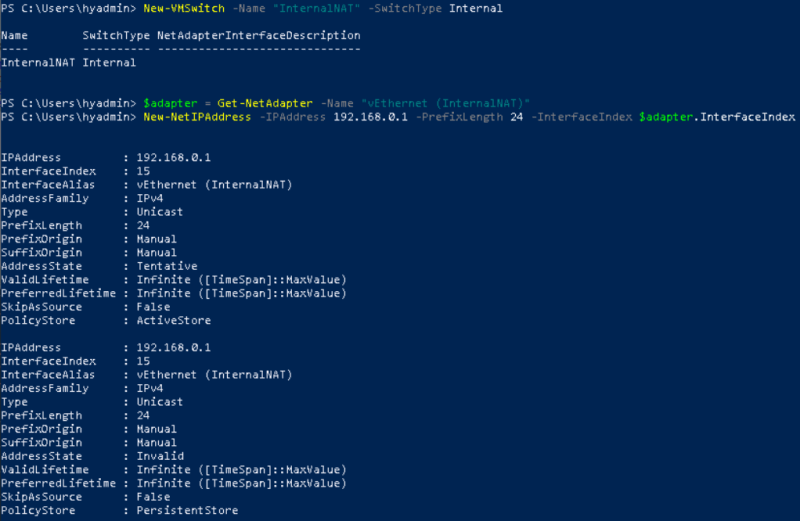

# Azure Migration : 伺服器移轉工具， 將 Hyper-V VM 遷移至 Azure
 透過 Azure VM 巢狀虛擬化建立單一 Hyper-V 主機，利用 Azure Migrate 輕鬆地將虛擬機器搬遷至 Azure。 
 您大約需要花費 75 分鐘完成此 Lab，透過手把手教學您將學會： 
 - 學會在 Azure 模擬內部部署 Hyper-V 環境 
 - 學會建立 Azure Migrate 專案 
 - 學會操作 Azure Migrate Assessment Tool 參考產出的報表預估每月費用與虛擬機器規格 
 - 學會操作 Azure Migrate Tool 一系列的複寫、測試移轉、正式移轉等流程 

## 環境準備  
 - Azure 訂用帳戶、Azure 訂用帳戶擁有者權限 
 - 下載 Single-Hyper-V.ps1 
	- 此命令會建立 D8sv3 的虛擬機器、虛擬網路、堡壘 
 - 下載 Azure-Migrate-Basic.ps1 
	- 此命令會建立移轉後虛擬機器的虛擬網路、公用 IP、網路安全性群組，後續會在移轉流程中使用 
 - 使用 Single-Hyper-V.ps1 佈署 Hyper-V Server   
	- 啟用 CloudShell 
    - 輸入`Connect-AzAccount` 登入 
	- 上傳 Single-Hyper-V.ps1 
	  
	  
	- 輸入並執行 `./Single-Hyper-V.ps1`  
 - 使用 Azure-Migrate-Basic.ps1 佈署移轉基礎環境   
	- 上傳 Azure-Migrate-Basic.ps1 
	- 輸入並執行 `./Azure-Migrate-Basic.ps1`  
 - 設定客體虛擬機器的網際網路連線 
	- 進入 Azure Portal，選擇虛擬機器 hyperv，使用 Bastion 連線 (hyadmin/hyadmin@1234)  
	  
	- 開啟 `VMs-Networking-Config.ps1` 並全選複製指令  
	- 開啟 Powershell 貼上指令執行 
	  
	  
 - 在虛擬機器 hyperv 中下載 VHD  
	- 下載 Linux-AP 並解壓縮  https://aka.ms/vhd-linux-ap 
	  
	- 下載 win2k16-AP 並解壓縮  https://aka.ms/vhd-win2k16-ap 
	> **Tips.建議關閉 IE Enhanced Security Configuration**  
 - 開啟 Hyper-V Manager 
		
 - 選擇 Import Virtual Machine 匯入 Linux Server (isadmin/isadmin@123) 
 		
		
		
		
		
 - 選擇 Import Virtual Machine 匯入 Windows Server (administrator/isadmin@123) 
	- 如上述步驟一致，只要改選擇 win2k16-ap 資料夾即可 
 - 前置環境作業完成 
  	- 確認已建立兩台 VM 
		
 	- 確認能正常顯示 Apache (192.168.0.4)、IIS Web (192.168.0.5) 
		

## 移轉流程  
 - [Lab1 - 建立 Azure Migrate](Lab1.md) 
 - [Lab2 - 發現 Hyper-V VM](Lab2.md) 
 - [Lab3 - 評定 Hyper-V VM](Lab3.md) 
 - [Lab4 - 移轉 Hyper-V VM](Lab4.md) 
 - [Lab5 - 複寫 Hyper-V VM](Lab5.md) 
 - [Lab6 - 執行測試移轉](Lab6.md) 
 - [Lab7 - 移轉 VM](Lab7.md) 
		
## 移轉後的最佳做法  

恭喜您已經完成了，但移轉後還是有些工作要做，後續工作您可以參考官方文件說明「移轉後的最佳做法」 
https://docs.microsoft.com/zh-tw/azure/migrate/tutorial-migrate-hyper-v#post-migration-best-practices

**參考來源與更詳細的說明**
https://docs.microsoft.com/zh-tw/azure/migrate/tutorial-prepare-hyper-v